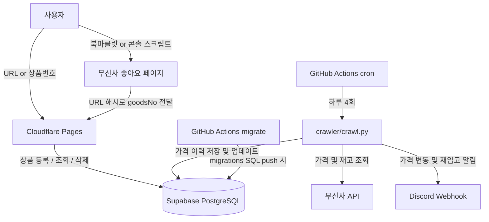

# 🛍️ Musinsa Price Tracker

무신사 좋아요 상품의 가격·품절 변동을 자동으로 추적하고 Discord로 알림을 보내주는 서비스

---

## ✨ 주요 기능

- **가격 추적** — 등록한 상품의 가격 변동 이력 그래프
- **품절 알림** — 품절 → 재입고 시 즉시 Discord 알림
- **최저가 알림** — 역대 최저가 갱신 시 알림
- **좋아요 일괄 등록** — 무신사 좋아요 목록을 북마클릿/콘솔 스크립트로 한번에 가져오기
- **멀티 유저** — 여러 사람이 각자의 관심 상품 관리 가능
- 쿠폰 적용가 기준 추적, 직전가 대비 변동률 표시
- 카테고리/브랜드/가격대 필터, 정렬, 검색
- 일괄 삭제 (실행취소), 가격 차트

---

## 🏗️ 아키텍처



---

## 🗂️ 프로젝트 구조

```
musinsa-price-tracker/
├── mpt-cloud/                    # 운영 중인 아키텍처
│   ├── frontend/
│   │   └── index.html            # 전체 UI (단일 파일)
│   ├── crawler/
│   │   ├── crawl.py              # 가격 크롤러
│   │   └── requirements.txt
│   ├── migrations/               # DB 마이그레이션 SQL
│   └── supabase-schema.sql       # 초기 스키마
│
└── .github/workflows/
    ├── crawl.yml                 # 크롤러 스케줄 (하루 4회)
    └── migrate.yml               # DB 마이그레이션 자동 실행
```

---

## 🚀 배포 방법 (최초 1회)

### 1. Supabase 설정

1. [Supabase](https://supabase.com) 프로젝트 생성
2. SQL Editor에서 `mpt-cloud/supabase-schema.sql` 실행
3. `migrations/` 폴더 내 SQL 파일 순서대로 실행
4. Project URL과 service_role key, anon key 복사

### 2. 프론트엔드 Supabase 연결

`mpt-cloud/frontend/index.html` 상단 설정 수정:

```javascript
const SUPABASE_URL = 'https://your-project.supabase.co';
const SUPABASE_ANON_KEY = 'your-anon-key';
```

### 3. Cloudflare Pages 배포

1. Cloudflare Pages에서 GitHub 저장소 연결
2. 빌드 설정: 빌드 명령 없음, 루트 디렉토리 `mpt-cloud/frontend`
3. main 브랜치 push 시 자동 배포

### 4. GitHub Secrets 설정

`Settings → Secrets and variables → Actions`에 추가:

| Secret | 설명 |
|---|---|
| `SUPABASE_URL` | Supabase Project URL |
| `SUPABASE_SERVICE_KEY` | service_role key (크롤러용) |
| `DISCORD_WEBHOOK_URL` | Discord 웹훅 URL (선택) |

---

## 📱 사용법

### 상품 등록

무신사 상품 URL 또는 상품번호를 입력창에 붙여넣고 등록.
여러 개를 콤마/줄바꿈으로 구분해서 한번에 등록 가능.

### 좋아요 일괄 가져오기

**북마클릿 방식**
1. 트래커 페이지 → 사용법 → 북마클릿 버튼을 북마크바로 드래그
2. 무신사 좋아요 페이지에서 북마크 클릭

**콘솔 스크립트 방식** (팝업 차단 환경)
1. 트래커 페이지 → 사용법 → 콘솔 스크립트 탭 → 복사
2. 무신사 좋아요 페이지에서 F12 → Console → 붙여넣기 → Enter

---

## 📦 기술 스택

| 영역 | 기술 | 비용 |
|---|---|---|
| 프론트엔드 | HTML/JS (단일 파일), Chart.js | Cloudflare Pages **무료** |
| 데이터베이스 | Supabase (PostgreSQL) | **무료** (500MB) |
| 크롤러 | Python 3.12 | GitHub Actions **무료** |
| 알림 | Discord Webhook | **무료** |
| **합계** | | **$0/월** |

## DB 마이그레이션

`mpt-cloud/migrations/`에 SQL 파일 추가 후 push → GitHub Actions가 자동 실행.

파일명 규칙: `001_설명.sql`, `002_설명.sql`, ...
